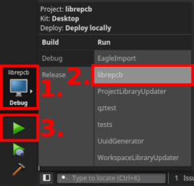

# LibrePCB

[](https://dev.azure.com/LibrePCB/LibrePCB/_build/latest?definitionId=2&branchName=master)
[](https://ci.appveyor.com/project/librepcb/librepcb/branch/master)
[](https://www.patreon.com/librepcb)
[](https://blockchain.info/address/1FiXZxoXe3px1nNuNygRb1NwcYr6U8AvG8)
[](https://webchat.freenode.net/?channels=#librepcb)


## About LibrePCB

LibrePCB is a free [EDA](https://en.wikipedia.org/wiki/Electronic_design_automation)
software to develop printed circuit boards. It runs on Linux, Windows and Mac.
The project is still in a quite early development stage (no stable release available).
See [Project Status](https://docs.librepcb.org/#projectstatus) for more information
about the currently available features, limitations and known bugs.


### Features

- Cross-platform (Unix/Linux/BSD, macOS, Windows)
- Multilingual (both application and library elements)
- All-In-One: project management + library/schematic/board editors
- Intuitive, modern and easy-to-use graphical user interface
- Very powerful library design with some innovative concepts
- Human-readable file formats for both libraries and projects
- Multi-PCB feature (different PCB variants of the same schematic)
- Automatic netlist synchronisation between schematic and board


## Installation & Usage

**Please read our [user manual](https://docs.librepcb.org/) to see how you can
install and use LibrePCB.**
The [Getting Started](https://docs.librepcb.org/#gettingstarted) guide
gives you a quick introduction to LibrePCB.

In addition to the installation methods described in the user manual, Arch
Linux users can also install the package
[librepcb-git](https://aur.archlinux.org/packages/librepcb-git/) from the AUR.
The package clones and builds the latest (unstable!) version of the `master`
branch from GitHub.


## Contributing

Contributions are welcome! See our [Contributing Guide](CONTRIBUTING.md) for
details.

For internal details take a look at the
[automatically generated documentation (doxygen)](https://doxygen.librepcb.org/)

## Development

***WARNING: The `master` branch always contains the latest UNSTABLE version of
LibrePCB. Everything you do with this unstable version could break your
workspace, libraries or projects, so you should not use it productively! For
productive use, please install an official release as described in the
[user manual](https://docs.librepcb.org/). For development, please read details
[here](https://developers.librepcb.org/df/d30/doc_developers.html#doc_developers_unstable_versions).***

### Requirements

To compile LibrePCB, you need the following software components:

- g++ >= 4.8, MinGW >= 4.8, or Clang >= 3.3 (C++11 support is required)
- [Qt](http://www.qt.io/download-open-source/) >= 5.2
- [zlib](http://www.zlib.net/)
- [OpenSSL](https://www.openssl.org/)

#### Prepared Docker Image

Instead of installing the dependencies manually on your system (see instructions
below), you can also use one of our
[Docker images](https://hub.docker.com/r/librepcb/librepcb-dev) with all
dependencies pre-installed (except GUI tools like QtCreator). These images are
actually used for CI, but are also useful to build LibrePCB locally.

#### Installation on Debian/Ubuntu/Mint

```bash
sudo apt-get install git build-essential qt5-default qttools5-dev-tools libglu1-mesa-dev openssl zlib1g zlib1g-dev libqt5opengl5-dev
sudo apt-get install qt5-doc qtcreator # optional
```

#### Installation on Arch Linux

```bash
sudo pacman -S git base-devel qt5-base qt5-tools desktop-file-utils shared-mime-info openssl zlib
sudo pacman -S qt5-doc qtcreator # optional
```

#### Installation on Mac OS X

1. Install Xcode through the app store and start it at least once (for the license)
2. Install [homebrew](https://github.com/Homebrew/brew) (**the** package manager)
3. Install *qt5*: `brew update && brew install qt5`
4. Make the toolchain available: `brew unlink qt && brew link --force qt5`

#### Installation on Windows

Download and run the
[Qt for Windows (MinGW) installer](http://download.qt.io/official_releases/qt/5.8/5.8.0/qt-opensource-windows-x86-mingw530-5.8.0.exe)
from [here](https://www.qt.io/download-open-source/). LibrePCB does not compile
with MSVC, so you must install following components with the Qt installer:

- The MinGW compiler itself
- The Qt libraries for MinGW

### Cloning

It's important to clone the repository recursively to get all submodules too:

```bash
git clone --recursive https://github.com/LibrePCB/LibrePCB.git && cd LibrePCB
```

### Updating

When updating the repository, make sure to also update all the submodules
recursively. Otherwise you may get strange compilation errors:

```bash
git submodule update --init --recursive
```

### Building

#### Using Qt Creator

Building with [Qt Creator](http://doc.qt.io/qtcreator/) is probably the easiest
way. Simply open the `librepcb.pro` file.

When opening a project in Qt Creator for the first time, you need to configure
the Desktop kit:


Click on the "Configure Project" button to get started.

Note: To keep build time as low as possible make sure to set the correct make
flags to use all available CPU cores to build. See this [stackoverflow
answer](https://stackoverflow.com/questions/8860712/setting-default-make-options-for-qt-creator).

#### Using qmake and make

Since Qt Creator is also using qmake and make to build, it's easy to do the same
on the command line:

```bash
mkdir build && cd build
qmake -r ../librepcb.pro
make -j 8
```

### Run LibrePCB

#### From Qt Creator

Select the run configuration `librepcb` and click on the `Run` button:



#### From Command Line

Execute inside the `build` directory:

```bash
./output/librepcb             # Unix/Linux
open ./output/librepcb.app    # Mac OS X
output\librepcb.exe           # Windows
```

### Installation

On a Unix/Linux system, LibrePCB can be installed with `sudo make install`.

### Workspace

At the first startup, LibrePCB asks for a workspace directory where the library
elements and projects are located. For developers there is a demo workspace
inclusive some libraries and projects (useful for testing purposes) at
[LibrePCB/demo-workspace](https://github.com/LibrePCB/demo-workspace).


## Credits

- First of all, many thanks to all of our [contributors](AUTHORS.md)!
- Thanks also to [cloudscale.ch](https://www.cloudscale.ch/) for sponsoring our
  API server!


## License

LibrePCB is published under the [GNU GPLv3](http://www.gnu.org/licenses/gpl-3.0.html) license.
